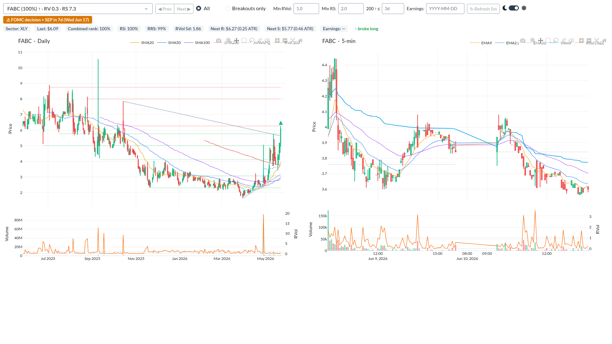

# Daily Relative Strength Scanner

An end-of-day stock scanner that ranks US-listed equities by **relative strength** — outperformance versus the market (SPY) and versus their sector — plus a Dash web GUI for reviewing candidates on daily and 5-minute charts.

The methodology is inspired by relative-strength swing-trading approaches (notably OneOption's "The System"): find stocks that are stronger than the market on a confirmed trend, and time entries off breakouts and support/resistance.

**Data source:** [yfinance](https://github.com/ranaroussi/yfinance) — free, no API keys required.

---

## What it does

Every trading day after the close, `run_daily_rs.py`:

1. Loads a ~7,000-ticker NASDAQ-screener universe (cached, auto-refreshed weekly)
2. Backfills / appends daily OHLCV bars into a local parquet cache (`.tmp/prices/`)
3. Applies hygiene filters (minimum price, minimum average volume)
4. Computes indicators: SMA 20/50/100/200, ATR%, quarterly anchored VWAP (AVWAPQ)
5. Scores six signal families:
   - **RS Simple** — log-return excess vs SPY (5/21/63-day windows)
   - **RRS** — volume-adjusted relative strength
   - **RS Sector** — stock vs sector ETF, and sector ETF vs SPY
   - **RVOL** — relative volume (5/21-day)
   - **RRV** — realized range vs ATR expectation
   - **Breakouts** — horizontal levels, trendlines, SMA200 reclaims
6. Percentile-ranks everything into a single `combined_rank` and writes `output/rs_<DATE>.csv` (~2,000–3,000 rows, sorted best-first)

The GUI (`run_gui.py`) reads the latest scan CSV and lets you flip through candidates with synchronized daily + intraday charts, support/resistance levels, breakout flags, earnings dates, and upcoming macro events.



## Quick start

Requires Python 3.10+.

```bash
git clone <this-repo>
cd daytrading
python -m venv .venv
source .venv/bin/activate        # Windows: .venv\Scripts\activate
pip install -r requirements.txt
```

### Run a smoke test first

The first full scan downloads ~400 days of history for ~7,000 tickers (30–60 minutes). Verify everything works on a small sample first:

```bash
python run_daily_rs.py --smoke
```

### Run the full daily scan

Run after 4:30 PM ET so the day's bar is final:

```bash
python run_daily_rs.py
```

Subsequent runs only append the latest bars, so they're much faster.

Useful flags:

| Flag | Default | Effect |
|---|---|---|
| `--min-price <float>` | 5.0 | Drop cheap stocks |
| `--min-volume <int>` | 1,000,000 | Drop illiquid stocks (20-day avg) |
| `--above-sma` | off | Require close above SMA 20/50/100/200 |
| `--above-avwapq` | off | Require close above quarterly anchored VWAP |
| `--breakouts-long` / `--breakouts-short` | off | Only tickers with a directional breakout today |
| `--lookback-days <int>` | 400 | History window for backfill |
| `--no-refresh` | off | Skip downloads, use cached prices only |
| `--output <path>` | `output/rs_<DATE>.csv` | Custom output path |

### Browse results in the GUI

```bash
python run_gui.py            # http://127.0.0.1:8050
python run_gui.py --debug    # hot reload + tracebacks
```

The GUI shows, for each ticker in the latest scan:

- **Daily chart** — candles, SMA stack, support/resistance levels, breakout markers
- **5-minute chart** — intraday candles with VWAP (fetched on demand; yfinance limits intraday history to ~60 days)
- Synchronized crosshair and a measurement tool across both charts
- Metadata bar: price, sector, RS ranks, breakout status, nearest support/resistance
- Earnings date lookup and macro-calendar warnings (events within 7 days, red alert under 3)
- Dropdown filters: breakouts only, minimum RVOL, minimum RS rank, SMA200-reclaim age

## A typical daily routine

1. **After the close (4:30 PM ET or later),** run the scan:

   ```bash
   python run_daily_rs.py
   ```

   For a long-biased watchlist of stocks in confirmed uptrends that broke a level today:

   ```bash
   python run_daily_rs.py --above-sma --breakouts-long
   ```

2. **Open the GUI** (`python run_gui.py`) — it automatically picks up the newest `output/rs_*.csv` and selects the top-ranked ticker.

3. **Narrow the candidate list** with the filter bar:
   - **Breakouts only** — keep tickers that broke a horizontal level, trendline, or the SMA200 today
   - **Min RV** — minimum 21-day relative volume (e.g. `1.5` = trading 50% above normal)
   - **Min RS** — minimum 21-day volume-adjusted relative strength (its t-stat-like scale makes `2.0` a sensible floor)
   - **200↑ age** — only stocks that reclaimed their SMA200 within the last N sessions (trend-reversal setups)

   Each dropdown entry shows the ticker's percentile rank, breakout direction (↑/↓), RVol, and RS at a glance.

4. **Review each candidate** with **Prev / Next**:
   - Daily chart (left): is the SMA stack aligned? Is price clear of resistance, or right at a level?
   - 5-minute chart (right): how did it trade into the close relative to VWAP?
   - Hover either chart — the crosshair syncs across both timeframes. Drag-select to measure a move's % change and ATR multiple.
   - Check the metadata bar for distance to nearest support/resistance in ATR multiples.

5. **Check the banners** before shortlisting: an earnings date or macro event (CPI, FOMC) inside 3 days shows a red warning — binary-event risk you probably don't want to hold through.

## Reading the output CSV

Each row is one ticker. The headline column is **`combined_rank`** (0–1 percentile; 0.99 means top 1% of the filtered universe). Other notable columns:

- `rs_simple_5d/21d/63d`, `rrs_5d/21d/63d` — raw RS scores per window
- `*_rank` — percentile rank of each signal family
- `stock_vs_sector_rs`, `sector_vs_spy_rs` — sector decomposition
- `broke_horizontal_long/short`, `broke_trendline_long/short`, `broke_sma200_long/short` — today's breakout flags
- `nearest_support` / `nearest_resistance` and their distances in ATR multiples
- `sma200_cross_up_age` — days since price reclaimed the SMA200

## Project layout

```
run_daily_rs.py    # CLI orchestrator (the daily scan)
run_gui.py         # Dash web GUI
gui/               # Layout, callbacks, daily/intraday chart builders
tools/
  data/            # yfinance fetchers, parquet cache, universe, earnings, macro calendar
  filters/         # Composable boolean filters (min price/volume, above SMA/AVWAPQ)
  indicators/      # SMA, EMA, ATR, anchored VWAP, swings, intraday VWAP/RVOL
  signals/         # The six signal families (pure functions, dict[str, float] out)
  ranking/         # Percentile ranking and combined_rank blending
  levels/          # Horizontal, trendline, and moving-average support/resistance
  universe/        # Sector → ETF mapping with manual overrides
  output/          # CSV writer with stable column order
workflows/         # Step-by-step docs for running and extending the scanner
tests/             # pytest suite (synthetic data, no network)
docs/              # README assets
.tmp/              # Local caches (prices, universe) — disposable, regenerated as needed
output/            # Scan results: rs_<DATE>.csv
```

## Configuration

No API keys or `.env` file are required. Paths and defaults live in `tools/config.py` and are derived from the repo root; two environment variables override them if you want caches elsewhere:

| Variable | Default | Purpose |
|---|---|---|
| `DAYTRADING_TMP_DIR` | `<repo>/.tmp` | Price/universe caches (disposable) |
| `DAYTRADING_OUTPUT_DIR` | `<repo>/output` | Scan result CSVs |

## Tests

```bash
pip install pytest
python -m pytest
```

The suite covers indicators, filters, signals, ranking, and config on synthetic OHLCV data — no network access needed.

## Extending it

Filters, indicators, and signals all follow small abstract base classes, so adding one is ~50 lines. The `workflows/` docs walk through it:

- [`workflows/daily_rs_scan.md`](workflows/daily_rs_scan.md) — full pipeline reference, edge cases, CSV interpretation
- [`workflows/add_new_signal.md`](workflows/add_new_signal.md) — how to add a scoring signal and wire it into ranking
- [`workflows/add_new_filter.md`](workflows/add_new_filter.md) — hygiene vs directional filters, and where each belongs

## Caveats

- **yfinance is unofficial.** It scrapes Yahoo Finance and is rate-limited; the fetcher retries failed chunks once and skips the rest, so an occasional ticker may be missing from a scan.
- **Intraday history is capped** at ~60 days of 5-minute bars by Yahoo.
- **Sector mapping is approximate.** The NASDAQ screener's sectors don't match GICS exactly; known misclassifications are patched in `tools/universe/sector_overrides.py`.
- **Earnings dates are spotty** for small caps; the GUI supports manual override.

## Disclaimer

This is a research and screening tool, not financial advice. Nothing here recommends buying or selling any security. Trade at your own risk.
